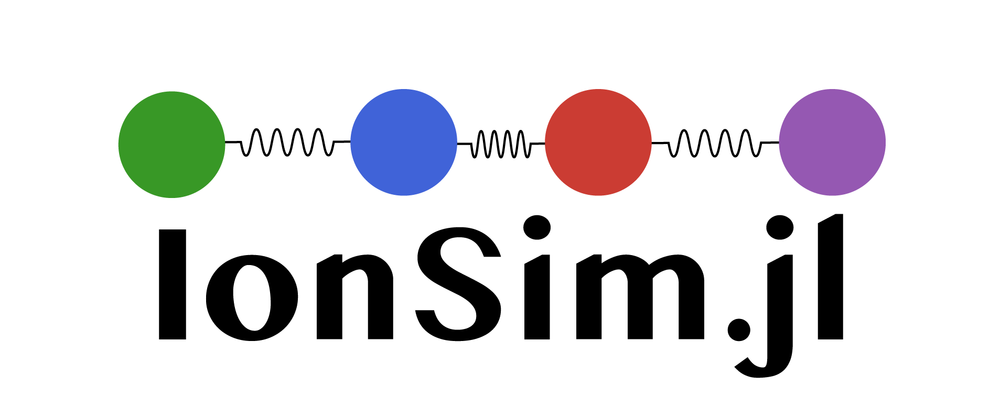
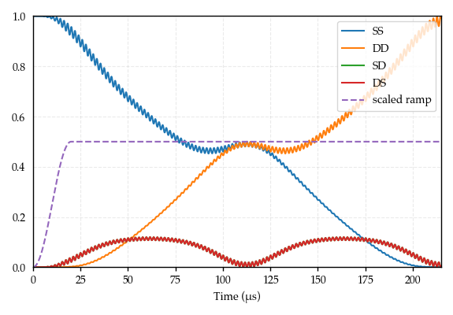
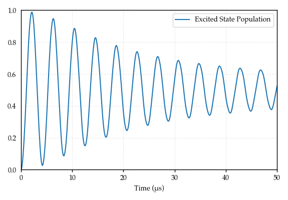
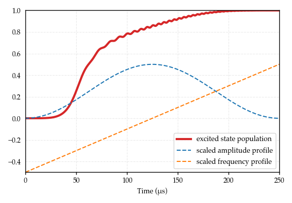

# IonSim

IonSim.jl is a lightweight Julia package for simulating the dynamics of a configuration of trapped ions interacting with laser light.

IonSim leverages [QuantumOptics.jl](https://qojulia.org/) to deliver a performant, quantitatively faithful tool for simulating fundamental interactions in trapped ion experiments. Several ion species and trap configurations are implemented. Everything is written in the language of experimentalists (ions and lasers, not qubits and gates).

* *Fast*: Runtimes comparable to QuTiP (Cython).
* *Intuitive*: You set up your simulation the same way that you set up your experiments.
* *Flexible*: Full control over RWA cutoff frequencies, Lamb-Dicke order approximations, Hilbert space truncation and methods.
* *Open Source*: All source code is freely available and built with extensibility in mind.

<iframe src="https://ghbtns.com/github-btn.html?user=HaeffnerLab&repo=IonSim.jl&type=star&count=true&size=medium" frameborder="0" scrolling="0" width="170" height="30" title="GitHub" style="padding-bottom: 10px;"></iframe>

# Documentation

[The IonSim docs are at this link](https://docs.ionsim.org/).

# Planned features

In the immediate future, we plan to implement:
* configurable ion species
* using ion traps with different noise models

See [our GitHub issues](https://github.com/HaeffnerLab/IonSim.jl/issues) for the full details.

# Contact the developers

IonSim is maintained by [Hartmut Haeffner's trapped ion group](https://ions.berkeley.edu/) at UC Berkeley.

If you'd like to contribute to IonSim.jl, head over to our [GitHub page](https://github.com/HaeffnerLab/IonSim.jl).
* If you have a good idea of what you'd like to do and how to do it, the preferred method is to submit a pull request on GitHub.
* If you're less sure about your ideas, would like some feedback, or want to open up a discussion, then feel free to open an issue on GitHub.

# Examples

[Check out all of our examples here](https://examples.ionsim.org/).

## Molmer-Sorenson

```julia
using IonSim

# Construct the system
C = Ca40(["S-1/2", "D-1/2"])
L1 = Laser(ϕ=π); L2 = Laser()  # note the π-phase between L1/L2
chain = LinearChain(
        ions=[C, C], com_frequencies=(x=3e6, y=3e6, z=2.5e5),
        vibrational_modes=(;z=[1])
    )
T = Trap(
        configuration=chain, B=6e-4, Bhat=(x̂ + ẑ)/√2,
        lasers=[L1, L2]
    )
mode = T.configuration.vibrational_modes.z[1]

# Set the laser parameters
ϵ = 10e3
d = 350  # correct for single-photon coupling to sidebands
Δf = transition_frequency(T, 1, ("S-1/2", "D-1/2"))
L1.Δ = Δf + mode.ν + ϵ - d
L2.Δ = Δf - mode.ν - ϵ + d
L1.k = L2.k = ẑ
L1.ϵ = L2.ϵ = x̂
# set 'resonance' condition: ηΩ = 1/2ϵ
η = abs(get_η(mode, L1, C))
E = Efield_from_pi_time!(η/ϵ, T, 1, 1, ("S-1/2", "D-1/2"))
Ω = t -> t < 20 ? E * sin(2π * t / 80)^2 : E  # ampl. ramp
L1.E = L2.E = t -> Ω(t)

# Build Hamiltonian
h = hamiltonian(T, lamb_dicke_order=1, rwa_cutoff=Inf)

# Solve
t, sol= solve(0:.1:220, C["S-1/2"] ⊗ C["S-1/2"] ⊗ mode[0], h)
```

```julia
import PyPlot
const plt = PyPlot

SS = expect(ionprojector(T, "S-1/2", "S-1/2"), sol)
DD = expect(ionprojector(T, "D-1/2", "D-1/2"), sol)
SD = expect(ionprojector(T, "S-1/2", "D-1/2"), sol)
DS = expect(ionprojector(T, "D-1/2", "S-1/2"), sol)
plt.plot(t, SS, label="SS")
plt.plot(t, DD, label="DD")
plt.plot(t, SD, label="SD")
plt.plot(t, DS, label="DS")
plt.plot(t, @.(Ω(t) / 2E), ls="--", label="scaled ramp")
plt.legend(loc=1)
plt.xlim(tout[1], tout[end])
plt.ylim(0, 1)
plt.xlabel("Time (μs)")
```



## Rabi flop

```julia
using IonSim

# Construct the system
C = Ca40(["S-1/2", "D-1/2"])
L = Laser()
chain = LinearChain(
        ions=[C], com_frequencies=(x=3e6, y=3e6, z=1e6),
        vibrational_modes=(;z=[1])
    )
T = Trap(configuration=chain, B=4e-4, Bhat=ẑ, lasers=[L])

# Set the laser parameters
L.k = (x̂ + ẑ)/√2
L.ϵ = (x̂ - ẑ)/√2
L.Δ = transition_frequency(T, 1, ("S-1/2", "D-1/2"))
Efield_from_pi_time!(2e-6, T, 1, 1, ("S-1/2", "D-1/2"))

# Set the vibrational mode Hilbert space dimension
mode = T.configuration.vibrational_modes.z[1]
mode.N = 100

# Construct initial state
ρi_ion = dm(C["S-1/2"])
ρi_mode = thermalstate(mode, 10)  # thermal state n̄=10
ρi = ρi_ion ⊗ ρi_mode

# Construct the hamiltonian
h = hamiltonian(T, timescale=1e-6)

# Solve the system
tout, sol = solve(0:.1:50, ρi, h)
```

```julia
import PyPlot
const plt = PyPlot

plt.plot(
        tout, expect(ionprojector(T, "D-1/2"), sol),
        label="Excited State Population"
    )
plt.xlim(tout[1], tout[end])
plt.ylim(0, 1)
plt.xlabel("Time (μs)")
plt.legend(loc=1)
```



## RAP

```julia
using IonSim

# Construct the system
C = Ca40(["S-1/2", "D-1/2"])
L = Laser()
chain = LinearChain(
        ions=[C], com_frequencies=(x=3e6, y=3e6, z=1e6),
        vibrational_modes=(;z=[1])
    )
T = Trap(configuration=chain, B=2.9e-4, Bhat=ẑ, lasers=[L])

# Set the laser parameters
L.k = (x̂ + ẑ)/√2
L.ϵ = (x̂ - ẑ)/√2
L.Δ = transition_frequency(T, 1, ("S-1/2", "D-1/2"))
# Set pi_time to 4 μs
E = Efield_from_pi_time(4e-6, T, 1, 1, ("S-1/2", "D-1/2"))

# We'll linearly sweep through the laser's frequency over
# [-125, +125] kHz (detuned from the carrier transition) in a time Tp

Tp = 250
Δϕ = Tp * 1e-3
L.ϕ = t -> 2π * (-Δϕ/2 + (Δϕ / Tp) * t) * t

# And also smoothly turn on and off the laser's electric field strength
Ω = t -> E * sin(π * t/Tp)^2

# Build Hamiltonian
h = hamiltonian(T, rwa_cutoff=Inf, lamb_dicke_order=1)

# Solve system
tout, sol = solve(0:.1:Tp, C["S-1/2"] ⊗ mode[0], h)
```

```julia
import PyPlot
const plt = PyPlot

plt.plot(
        tout, expect(ionprojector(T, "D-1/2"), sol),
        lw=3, color="C3", label="excited state population"
    )
plt.plot(
        tout, @.(L.E(tout) / 2E),
        ls="--", label="scaled amplitude profile"
    )
plt.plot(
        tout, @.(L.ϕ(tout) / (2π * Δϕ * tout)),
        ls="--", label="scaled frequency profile"
    )
plt.xlim(tout[1], tout[end])
plt.legend(loc=4)
plt.xlabel("Time (μs)")
```


